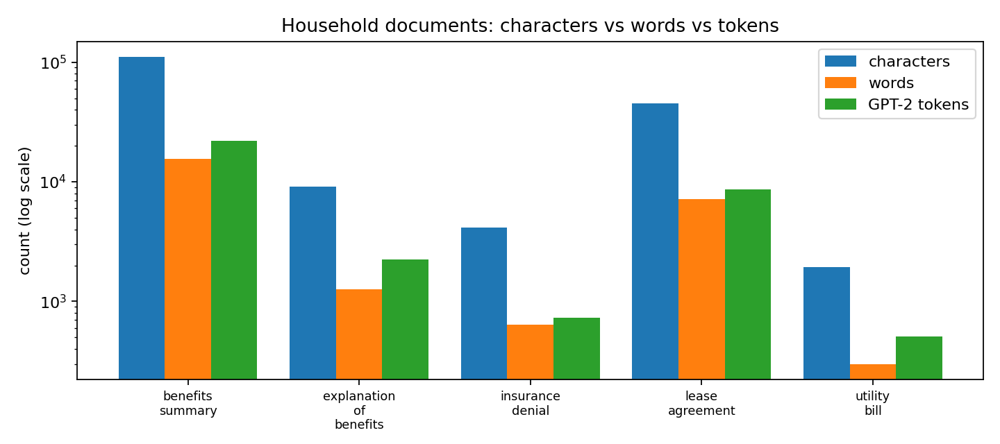
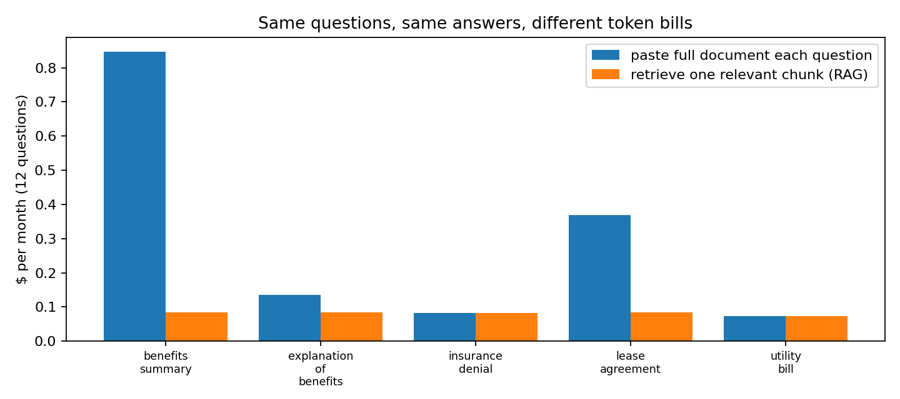
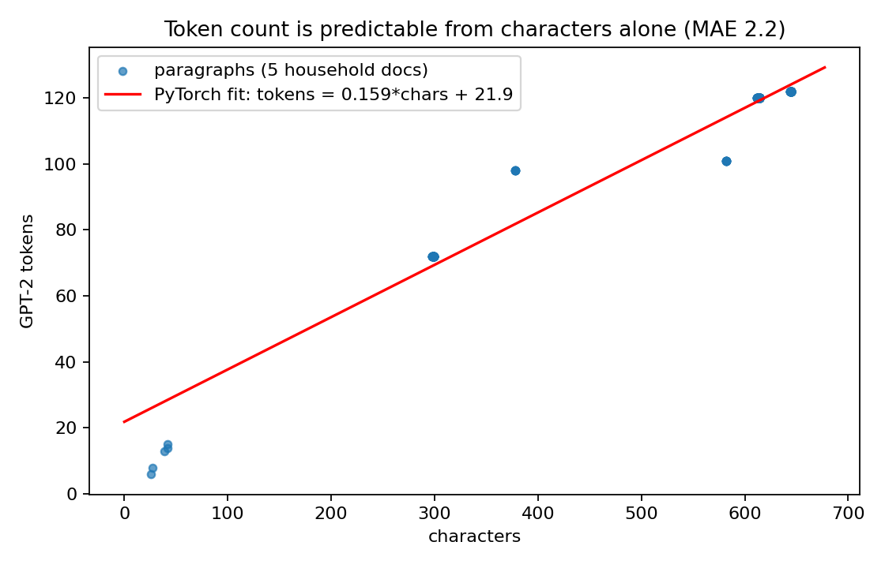

# Project 02: What household paperwork costs in tokens (and how to cut the bill)

Book concept ([ML4LLM](https://github.com/mikexcohen/ML4LLM_book) project 2): measure document
length in **characters, words, and GPT-2 BPE tokens** and see how tightly the three scale together.

Applied here to a problem middle-income households actually have: pasting a lease, an insurance
denial, or an employee benefits handbook into a pay-per-token AI API and paying to re-send the
whole document with every follow-up question.

## The corpus

Five synthetic documents sized and worded like the real thing (no real people or account data -
see `make_docs.py`): a 70-clause lease, an insurance denial letter, a year-to-date EOB, a
180-item benefits handbook, and a utility bill.

| document | chars | words | GPT-2 tokens |
|---|---|---|---|
| benefits handbook | 110,816 | 15,486 | 21,976 |
| lease agreement | 45,310 | 7,143 | 8,689 |
| explanation of benefits | 9,065 | 1,267 | 2,235 |
| insurance denial | 4,129 | 642 | 735 |
| utility bill | 1,928 | 298 | 507 |



## Part 2: the cost of the lazy default

Scenario: 12 questions/month per document, representative mid-2026 API rates ($3/M input,
$15/M output: edit `RATE_IN`/`RATE_OUT` in `analyze.py` for current pricing).

**Paste-the-whole-document** vs **retrieve one relevant ~800-token chunk** (the core RAG idea):

| | monthly | yearly |
|---|---|---|
| full document every question | $1.51 | $18.08 |
| chunk retrieval | $0.41 | $4.90 |
| **saved** | **72.9%** | **$13.18/yr** |



Honest read: for one household this is lunch money: the point is the *ratio*. The same 72.9%
applies to any consumer app that answers questions over user documents: at 100,000 households
the identical arithmetic is ~$1.8M/yr vs ~$0.5M/yr in inference spend. Long documents are where
it bites: the benefits handbook alone shows a 90% cut.

## Part 3: a PyTorch estimator, no tokenizer needed

The book's finding is that chars/words/tokens correlate almost perfectly. Tested by training a
one-feature linear model (`tokens = a·chars + b`, plain SGD, `estimator.py`) on 297 paragraphs:

```
fit: tokens = 0.1586 * chars + 21.86   (≈6.3 characters per GPT-2 token)
MAE:  2.2 tokens per paragraph
MAPE: 4.8%
```



So a budgeting feature can estimate token cost within about 5% from `len(text)` alone, with
no 50k-vocab tokenizer shipped to the client.

## Limitations

- Documents are synthetic with repeated template clauses, so estimator points cluster by
  paragraph type; slope on real heterogeneous documents will differ somewhat (English prose
  typically runs ~4 chars/token; legal boilerplate compresses better).
- Rates are representative list prices, not a quote; caching/batch discounts change absolutes,
  not the full-vs-chunk ratio.
- Chunk retrieval assumes the answer lives in one chunk; multi-hop questions need more context.

## Run it

```bash
python make_docs.py   # writes docs/*.txt
python analyze.py     # counts, cost tables, part1/part2 charts
python estimator.py   # PyTorch fit, part3 chart
python -m pytest -q   # 6 checks
```

Requires: `torch`, `transformers`, `matplotlib`.

---
*Lakshmi Sravani Putta · sravannicareerv@gmail.com · [linkedin.com/in/sravani-p-212899272](https://linkedin.com/in/sravani-p-212899272)*
