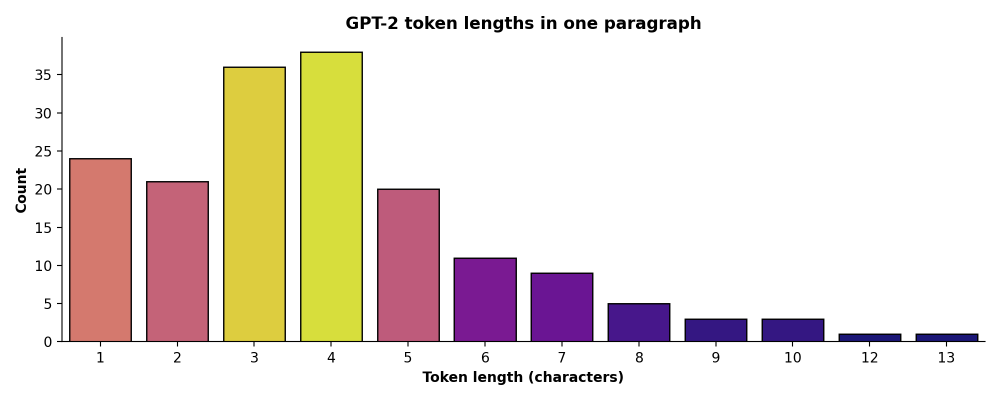
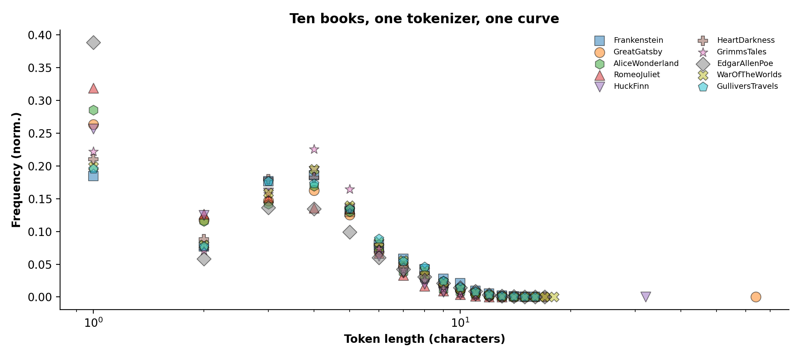
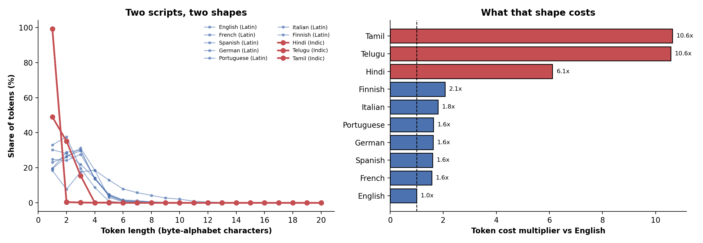
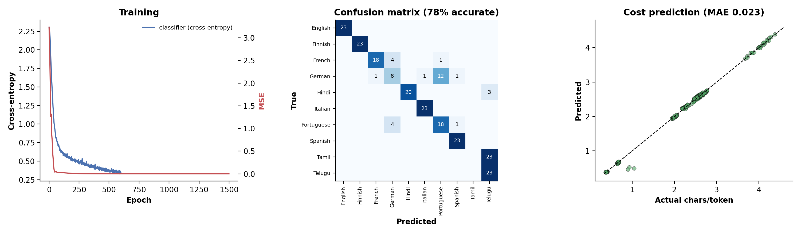
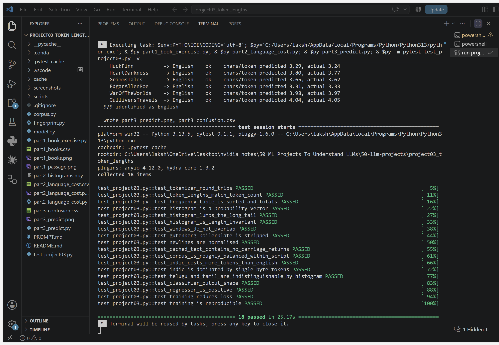

# Project 03: Token-length histograms, and what they tell you before you spend a rupee

Book concept ([ML4LLM](https://github.com/mikexcohen/ML4LLM_book) project 3): build **pandas
frequency tables of token lengths** — tokenize with GPT-2 BPE, measure each token's length in
characters, and study the distribution rather than the mean.

Applied here to the question Projects 1 and 2 left open. Project 1 found Telugu costs GPT-2 far
more tokens than English; Project 2 found English documents run about 6.3 characters per token.
Neither explained *why*. The distribution does.

The practical use: before sending a document to a pay-per-token API you want to know what script
it is in and what it will cost. Sending it somewhere to find out defeats the purpose on both
privacy and cost. A token-length histogram is 20 numbers you can compute locally in milliseconds.

## Part 1: the book exercise

One paragraph, then ten Project Gutenberg books normalised and plotted on a log-x axis.



The passage tokenizes to 172 tokens from 677 characters. Token lengths run 1–13 characters and
peak at 4.



| | chars/token |
|---|---|
| Romeo & Juliet | 3.11 |
| Huckleberry Finn | 3.24 |
| Alice in Wonderland | 3.25 |
| Edgar Allen Poe | 3.33 |
| The Great Gatsby | 3.48 |
| Grimms' Tales | 3.62 |
| Heart of Darkness | 3.77 |
| War of the Worlds | 3.97 |
| Gulliver's Travels | 4.05 |
| Frankenstein | 4.12 |

Ten books across two centuries, in registers from Elizabethan verse to Mississippi vernacular,
span **1.01 chars/token end to end**. The tokenizer's vocabulary, not the author, decides where
words break. (Romeo & Juliet sits at the bottom because a play is full of speaker labels and
line breaks, and a newline is a token.)

## Part 2: nine languages, two shapes

Latin-script books from Gutenberg; Telugu, Hindi and Tamil from Wikipedia extracts (~150k
characters each, balanced on purpose).



| language | script | chars/token | length-1 tokens | cost vs English |
|---|---|---|---|---|
| English | Latin | 4.12 | 18.5% | 1.0x |
| French | Latin | 2.63 | 24.8% | 1.6x |
| Spanish | Latin | 2.58 | 19.4% | 1.6x |
| German | Latin | 2.54 | 23.1% | 1.6x |
| Portuguese | Latin | 2.53 | 19.7% | 1.6x |
| Italian | Latin | 2.29 | 30.3% | 1.8x |
| Finnish | Latin | 2.00 | 33.0% | 2.1x |
| **Hindi** | Indic | 0.67 | **49.0%** | **6.1x** |
| **Telugu** | Indic | 0.39 | **99.2%** | **10.6x** |
| **Tamil** | Indic | 0.39 | **99.2%** | **10.6x** |

**What "token length" means here.** GPT-2 is a *byte-level* BPE tokenizer — it never sees
characters, only UTF-8 bytes mapped into a printable surrogate alphabet. For English one
surrogate is one letter. For Telugu, where one character is three UTF-8 bytes, it is not. So the
histogram measures bytes per token, while chars/token is measured against real user-visible
characters. The gap between those two numbers *is* the cost story.

Telugu and Tamil are at **99.2% single-byte tokens**: GPT-2's vocabulary contains essentially no
merges for either script, so every byte becomes its own token and the tokenizer degenerates to
raw UTF-8. Hindi sits at 49% — Devanagari appears often enough in GPT-2's training data to have
earned some merges. That difference is worth four and a half multiples of cost.

Even Finnish, in the same alphabet as English, costs 2.1x — agglutinative morphology produces
long words the vocabulary has never seen.

## Part 3: PyTorch on 20 numbers

Two small MLPs over the same histogram. 76 windows of 2,000 characters per language (balanced),
split contiguously 70/30 so held-out text comes from a different part of each document.



**Task 1 — which language?** 77.8% on 9 held-out classes against a 10% chance baseline. Script
(Latin vs Indic), which is the question that actually sets the bill, is **100%**.

**Task 2 — what will it cost?** MAE **0.023 chars/token** (1.6% MAPE), against 0.910 for
predicting the training mean — **39x better**. On nine English books the model never saw,
9/9 identified correctly with cost predicted to within 0.08 chars/token.

### Where it fails, and why that is the interesting part

Telugu scores 100% and Tamil 0%. Not a bug, and not fixable by training longer:

| pair | L1 distance between histograms |
|---|---|
| Tamil vs Telugu | **0.0020** |
| German vs Portuguese | 0.0685 |
| French vs German | 0.0874 |

The two closest non-Indic languages are **34x further apart** than Telugu and Tamil. Both scripts
collapse to pure byte tokens, so their fingerprints coincide and the classifier can only pick one.
Which one it picks is a coin flip decided by the initialisation seed:

| seed | overall | Telugu | Tamil | script |
|---|---|---|---|---|
| 0 | 77.8% | 100% | 0% | 100% |
| 1 | 79.6% | 0% | 100% | 100% |
| 2 | 80.4% | 0% | 100% | 100% |
| 3 | 79.1% | 100% | 0% | 100% |
| 4 | 79.1% | 0% | 100% | 100% |
| 5 | 79.1% | 0% | 100% | 100% |

Honest read: the histogram is a **cost** feature, not a **language-ID** feature. It nails the
thing you would actually use it for — 100% script detection and 1.6% cost error, every seed — and
it cannot separate two languages the tokenizer treats identically. Telling Telugu from Tamil needs
a feature that looks at *which* bytes, not how many.

## Run it

```bash
pip install torch transformers pandas seaborn matplotlib pytest
python corpus.py                 # downloads + caches; everything after this is offline
python part1_book_exercise.py
python part2_language_cost.py
python part3_predict.py
python -m pytest test_project03.py -q
```



The full run takes a few minutes on first execution while the corpus downloads; everything after
that is offline. Use an interpreter that actually has the dependencies — on this machine the
Anaconda `base` environment has no `torch`, so the run must use the system Python 3.13.

## Files

| file | what it does |
|---|---|
| `corpus.py` | fetch + cache Gutenberg books and Wikipedia extracts |
| `fingerprint.py` | the 20-number feature, defined once |
| `part1_book_exercise.py` | the book's two figures |
| `part2_language_cost.py` | nine-language table and cost multipliers |
| `model.py` | the two PyTorch heads |
| `part3_predict.py` | training, held-out evaluation, unseen-document check |
| `test_project03.py` | 18 tests |
| `PROMPT.md` | the prompt this project was built from |

Three traps worth knowing, all commented in `corpus.py`:

1. MediaWiki silently caps `exlimit` to 1 unless `exintro` is set, so a request for 20 full
   extracts returns one.
2. Random Wikipedia draws in te/hi/ta are overwhelmingly stubs, which is how the first "Hindi
   corpus" came back at 216 characters.
3. The one that quietly corrupted results: several Gutenberg files mix lone CR with CRLF, and
   `Path.write_text` on Windows translates LF to CRLF *again* on the way out. Reading the cache
   back through universal newlines then **doubled every blank line** — The Great Gatsby cached at
   277,090 characters against a true 270,690. The first run (fresh download) and every later run
   (warm cache) therefore tokenized different text: 84,246 tokens versus 82,535, a 2% gap.
   `normalise_newlines` plus `newline=""` on write fixes it, and the cold and warm caches now
   agree byte for byte.

Source text is cached under `cache/` and not committed — only derived statistics are.
No book text is reproduced here.
