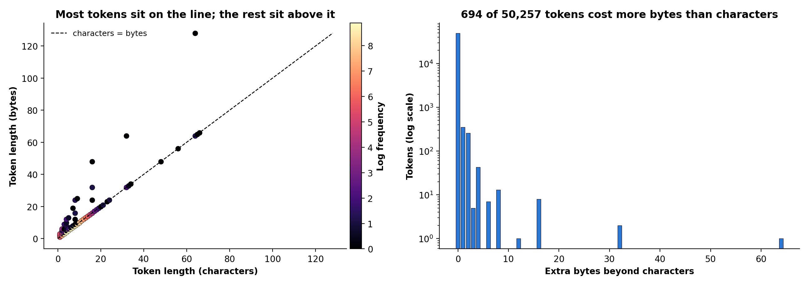
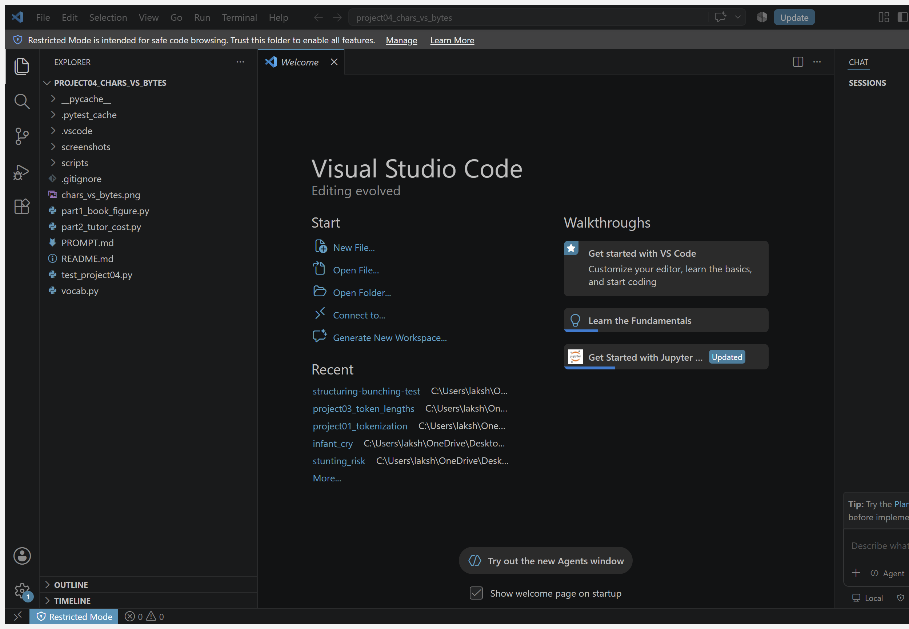

# Project 04: Characters vs bytes, and what it costs a Telugu-medium child

Book concept ([ML4LLM](https://github.com/mikexcohen/ML4LLM_book) project 4): every GPT-2 token
has **two lengths** — the characters it decodes to, and the UTF-8 bytes those characters occupy.
`x` is 1 byte, `ü` is 2, `活` is 3, `🥰` is 4.

Project 3 measured that GPT-2 charges Telugu 10.6x English per character. This project is the
one-line explanation: **a Telugu character is 3 UTF-8 bytes, and a byte-level tokenizer with no
Telugu merges bills per byte.**

## The detector

Eleven lines ([`vocab.py`](vocab.py)):

```python
def vocab_lengths(tok):
    surface = tok.convert_ids_to_tokens(list(range(tok.vocab_size)))
    n_bytes = np.array([len(s) for s in surface])
    n_chars = np.array([len(tok.decode([i])) for i in range(tok.vocab_size)])
    return n_chars, n_bytes
```

GPT-2's surface alphabet is one printable surrogate per byte, so the surface length *is* the
byte length.



| | |
|---|---|
| vocabulary | 50,257 tokens |
| characters == bytes | 49,563 (98.6%) |
| characters != bytes | 694 (1.4%) |
| worst offender | 64 extra bytes |
| longest token | 66 characters, 128 bytes |

98.6% of the vocabulary is ASCII, where the two lengths agree. Every non-Latin script lives in
the 1.4%.

## Method

*Low-Code AI* (Stripling & Abel, O'Reilly 2023) opens with the rule that any ML project must
begin by defining the goal, use case, or problem — data first, model last. Followed literally
here: the goal was a rupee figure per lesson, stated before any code, and the hypothesis below
was falsifiable without training anything. It got falsified.

## The hypothesis I set out to prove, and its failure

I expected the vocabulary table to give characters-per-token **exactly**, making project 3's
trained model unnecessary. Decoded token lengths should sum to the length of the text.

They do not:

| language | sum(bytes) | len(utf-8) | exact? | sum(chars) | len(text) | exact? |
|---|---|---|---|---|---|---|
| English | 200,969 | 200,969 | **yes** | 200,404 | 200,000 | no |
| Telugu | 404,233 | 404,233 | **yes** | 403,544 | 155,197 | no |
| Hindi | 384,172 | 384,172 | **yes** | 259,618 | 154,676 | no |
| Tamil | 399,759 | 399,759 | **yes** | 399,608 | 152,370 | no |

**Bytes are additive to the byte. Characters are not, and for Telugu the table over-counts by
2.6x.**

The reason is the thing this project is about. A Telugu character occupies three bytes, GPT-2
splits it across three tokens, and decoding one of those tokens alone returns the replacement
character `�` — one "character" where the true contribution is one third of one. `test_single_
telugu_token_does_not_round_trip` pins this down.

So **project 3's model was not unnecessary.** Characters-per-token genuinely cannot be read off
a per-token table for multi-byte scripts; you need the text. My hypothesis was wrong and the
test that asserts the failure is deliberately named `test_character_lengths_are_NOT_additive`,
so nobody later "fixes" it into a wrong identity.

## What it costs a child

One 4,000-character lesson, at a mid-2026 reference rate of $3.00 per million input tokens,
₹88 to the dollar. Text is Wikipedia prose cached by project 3 — a proxy for school reading
material, not actual textbooks.

| language | chars/token | bytes/token | tokens per lesson | ₹ | vs English |
|---|---|---|---|---|---|
| English | 4.142 | 4.162 | 966 | 0.25 | 1.0x |
| Hindi | 0.674 | 1.674 | 5,934 | 1.57 | 6.1x |
| **Telugu** | **0.390** | 1.016 | **10,259** | **2.71** | **10.6x** |
| Tamil | 0.388 | 1.018 | 10,314 | 2.72 | 10.7x |

Two lessons a day, 200 school days:

| | a year of AI tutoring |
|---|---|
| English medium | **₹102** |
| Telugu medium | **₹1,083** |

Same lesson, same model, same answer. On an identical budget the Telugu-medium child gets
**10.6x fewer lessons**. The 10.6x here was computed from the vocabulary and the text; project 3
reached the same 10.6x from a completely different route (token-length histograms), which is a
useful independent check.

## Who this is about

Not a hypothetical child. Andhra Pradesh runs tribal welfare residential schools and ashram
schools, and the Tribal Welfare Department said last week it is working to improve their
educational standards and infrastructure. ₹4,764 crore is allocated for the development of 27.39
lakh tribal people, with 1.5 lakh tribal youth to receive skill training and support for
competitive examinations (*The Hindu*, Vijayawada, 10 August 2026).

Those children are Telugu-medium, state-funded, and the least able to absorb a 10.6x price on
the same lesson. If AI tutoring is procured per token — and it is — the pricing is regressive by
construction, before anyone makes a policy decision about it.

## On attention and green space

The other well-evidenced lever on children's focus is nature exposure — Attention Restoration
Theory (Kaplan, 1995), and Taylor & Kuo's finding that greener play settings are associated with
milder ADHD symptoms.

**This project does not measure any of that.** No public dataset links Indian school green space
to attention outcomes, and manufacturing one would be worse than leaving the gap visible. It is
cited as context for why the tokenizer gap matters — a child who already has less attention to
spend should not also get less tutoring per rupee — and it appears in no results table.

## Honest limitations

- Wikipedia prose stands in for textbooks. Real Telugu school material may tokenize differently.
- One tokenizer. GPT-2 is the book's subject; modern multilingual tokenizers close much of this
  gap, and the honest headline is about byte-level BPE without script-specific merges, not about
  every model on the market.
- The rupee figures move with whatever a provider charges; the **ratio** is the durable result.

## Run it

```bash
pip install numpy matplotlib transformers pytest
python part1_book_figure.py
python part2_tutor_cost.py
python -m pytest test_project04.py -q
```



Reads the corpus cached by project 3; run that project's `corpus.py` first if `cache/` is empty.

## Files

| file | |
|---|---|
| `vocab.py` | the 11-line table |
| `part1_book_figure.py` | the book's characters-vs-bytes figure |
| `part2_tutor_cost.py` | additivity check and the cost table |
| `test_project04.py` | 8 tests |
| `PROMPT.md` | the prompt this was built from |

No book text is reproduced here.
